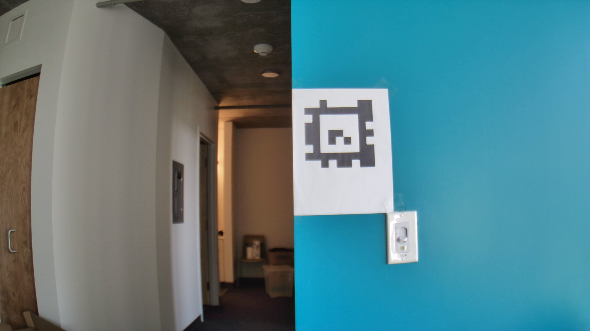
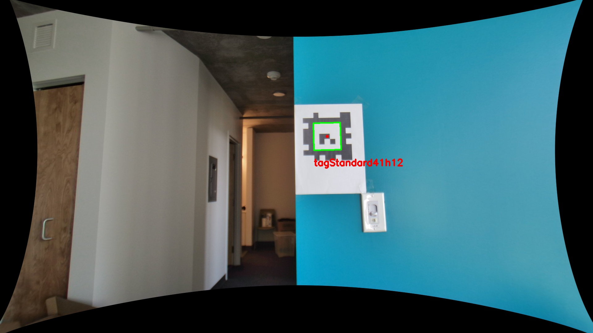
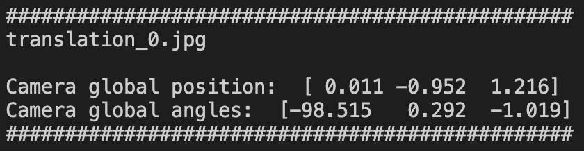

# Camera localization using AprilTags 

- **Goal**: Measure the locations of the camera and compare them with AprilTags’ algorithm output/
- Translation/rotation estimation experiment results: [[link](https://docs.google.com/presentation/d/1nB0fvfwQufdiujhKGforBgsoaFsC6xwerG_3aSSScB0/edit#slide=id.gdd6fadd917_0_0)]

## Example of translation estimation

### Original image:

- Measured translation of camera: x = 0 cm, y = -94.5 cm, z = 122.5 cm

### Undistorted image with AprilTag detected:

### Localization algorithm output:

- Algorithm output (in meters): x = 0.011, y = -0.953, z = 1.219
